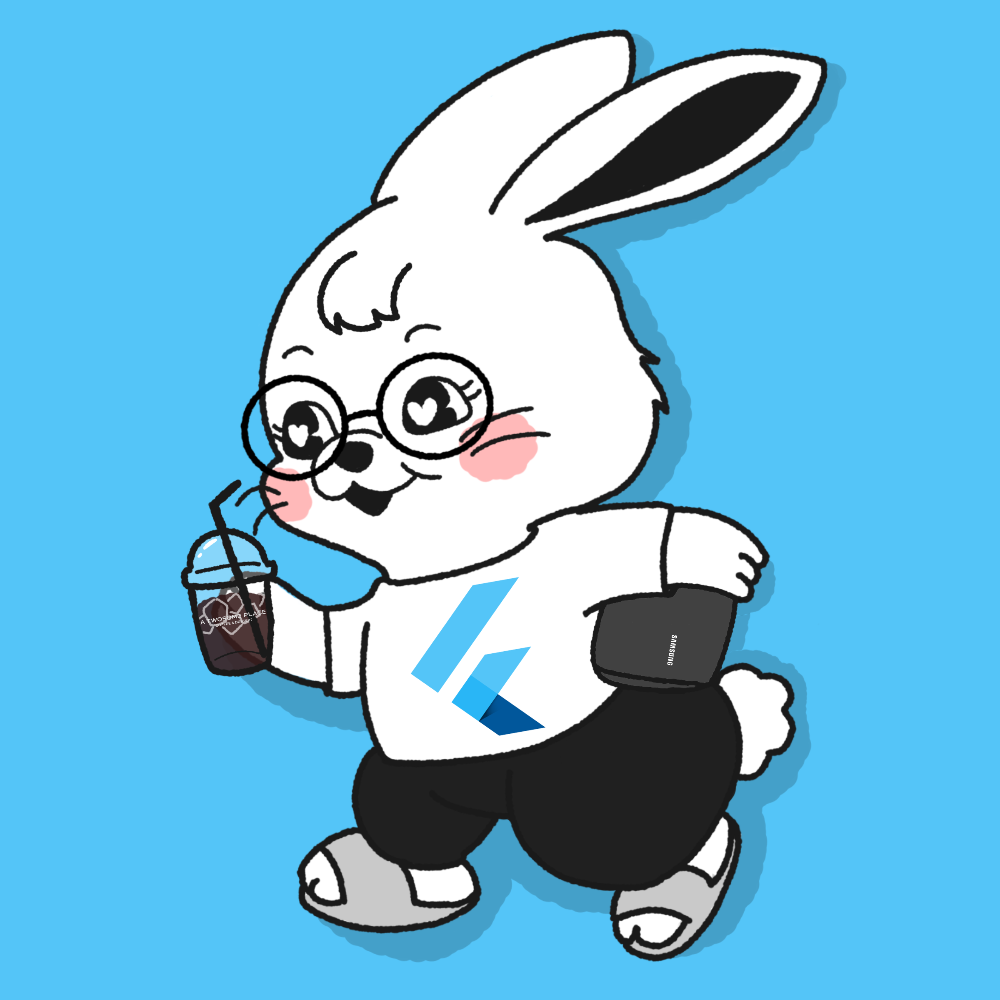

<h1 align="center">Hi I'm SIA</h1>

## Tech Stack

  
  
  
  
  
  
  
  
  
  
  
  
  
  
  
  
  
  
  
  
  
  
  
  
  
  
  
  
  
  
  
  
  
  
  
  
  
  
  
  
  
  
  
  

## Project List

### Main Project

- [Matrix_Crafter](https://github.com/3rr0r404N07F0UND/Matrix_Crafter.git) - 행렬 계산기
- [HexMagic](https://github.com/3rr0r404N07F0UND/HexMagic.git) - 진수 계산기
- [velog](https://github.com/3rr0r404N07F0UND/velog.git) - 블로그 구버전
- [ddon_kiosk](https://github.com/3rr0r404N07F0UND/ddon_kiosk.git) - 돈돈정 키오스크 - 팀프로젝트
- [pacman](https://github.com/3rr0r404N07F0UND/PacMan.git) - 캔버스 팩맨 게임
- [rabbitfy](https://github.com/3rr0r404N07F0UND/rabbitfy.git) - 음악 플레이어
- airkorea - 공기질 모니터링
- [memo](https://github.com/3rr0r404N07F0UND/memo.git) - 메모장 SPA
- kold - 날씨 모니터링
- Relog - 블로그
- [damhwa](https://github.com/3rr0r404N07F0UND/damhwa.git) - openai api 사용한 쇼핑몰 및 행사 제공 사이트 - 팀프로젝트

### Side Project

- [여우별](https://github.com/3rr0r404N07F0UND/starFox.git) - discord chat bot - 소스코드 비공개
- [JsonParser](https://github.com/3rr0r404N07F0UND/JsonParser.git) - json 접근 방식들
- [csvToJson](https://github.com/3rr0r404N07F0UND/csvToJson.git) - csv 파일을 json으로
